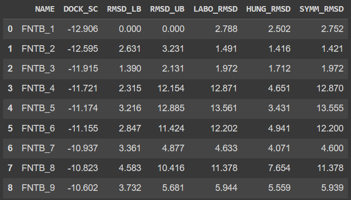
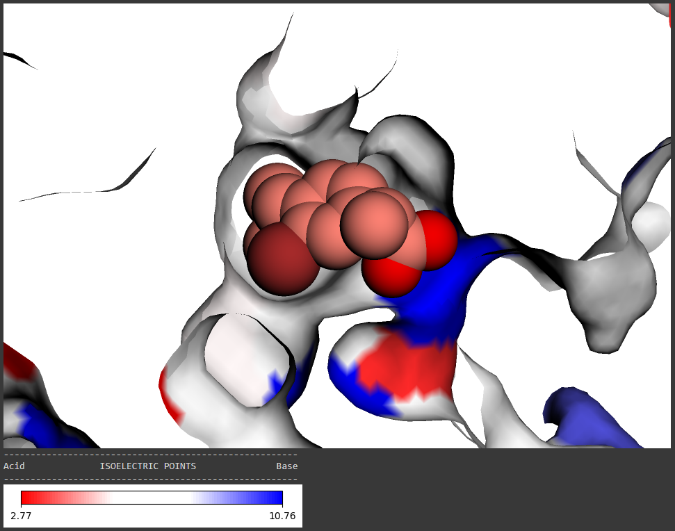
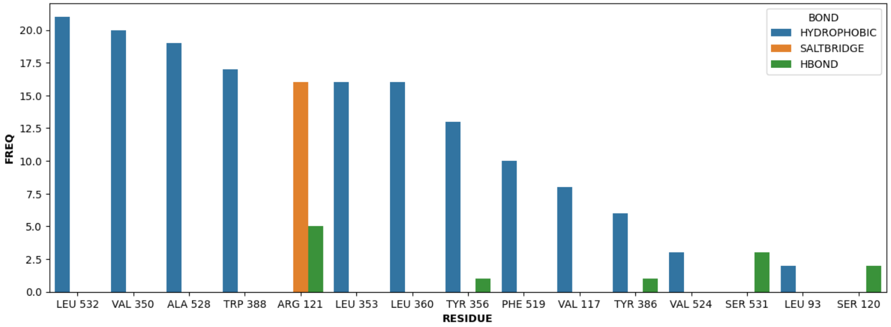
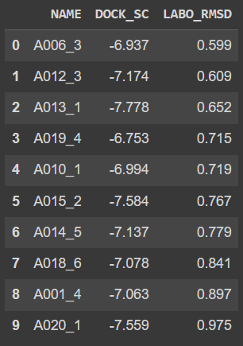

# Effortless Docking with Google Colab

**LABODOCK** hosts a collection of Jupyter Notebooks that provides straightforward approach to molecular docking on Google Colab with minimal coding proficiency. Through leveraging well-established cheminformatic tools and Google Colab's cloud computing capabilities, this repository aimed to streamline the entire molecular docking protocols, automating various pre- and post-docking processes for seamless, intuitive and interactive *in-silico* experimentation. Current available notebooks are:

+ [Basic Molecular Docking](./notebooks/basic_molecular_docking.ipynb)
+ [Virtual Screening](./notebooks/virtual_screening.ipynb) 

> [!IMPORTANT]
> Do not use the `Run all` option at the beginning. Run the `Install dependencies and softwares` cell individually and wait for the session to restart. **After that**, you can use the `Run all` options if you want.

## Features
+ Intuitive and user-friendly form field
+ Autodock Vina-driven molecular docking operation
+ PLIP-integrated binding interaction analysis with bar chart
+ ✨ Automated docking result clustering: **
	+ `Best-Pose`: Pose with best docking score from each ligand
 	+ `LABO-RMSD`: Pose with lowest LABO-RMSD from each ligand  
+ ✨ **Six** grid box defining methods: 
	+ [`LaBOX`](https://github.com/RyanZR/LaBOX)
	+ [`eBoxSize`](https://github.com/michal-brylinski/eboxsize) 
	+ `eBoxSize-Mod`
	+ `Autodock-Grid`
	+ `Manual-Mode`
	+ `Defined-by-Res`
+ ✨ **Three** RMSD calculation methods:
	+ `LABO_RMSD`: Based on RDKit's maximum common substructure search
	+ `HUNG_RMSD`: Based on [spyrmsd](https://github.com/RMeli/spyrmsd)'s Hungarian algorithm calculation
	+ `SYMM_RMSD`: Based on [spyrmsd](https://github.com/RMeli/spyrmsd)'s symmetrical-corrected calculation
+ ✨ Maximum common substructure PNG generation
+ ✨ 3D basic informative molecular visualization with colour scale:
	+ `Hydrophobicity scale` *(Kyte and Doolittle, 1982)*
	+ `Isoelectric points scale`

*\*\* Exclusive for virtual screening protocol.*

## Images
|  |
|-|
| `BMD` Redocked Fenebrutinib (red) Superimposed on 9AJ (gray) with PDB 5VFI |

|  |
|-|
| `BMD` Docking Scores and RMSDs of Redocked Fenebrutinib |

|  |
|-|
| `VS` Docked CHEMBL161052 in Slab View with PDB 4PH9 sagittal section |

|  |
|-|
| `VS` PLIP Binding Interaction Frequency Bar Chart |

|  |
|-|
| `VS` Top 10 Poses with Lowest LABO-RMSD from each ligands |

## Limitation
+ These notebooks are designed for Google Colab and may not work on other platform.
+ These notebooks provide a simple pipeline for illustrating molecular docking and do not necessarily reflect the standard protocol.

## References
1. Adasme, M. F., Linnemann, K. L., Bolz, S. N., Kaiser, F., Salentin, S., Haupt, V. J., & Schroeder, M. (2021). **PLIP 2021: Expanding the scope of the protein–ligand interaction profiler to DNA and RNA**. *Nucleic Acids Research*, *49*(W1), Article W1. https://doi.org/10.1093/nar/gkab294
2. Feinstein, W. P., & Brylinski, M. (2015). **Calculating an optimal box size for ligand docking and virtual screening against experimental and predicted binding pockets**. *Journal of Cheminformatics*, *7*, 18. https://doi.org/10.1186/s13321-015-0067-5
3. Meli, R., & Biggin, P. C. (2020). **spyrmsd: Symmetry-corrected RMSD calculations in Python**. *Journal of Cheminformatics*, *12*(1), 49. https://doi.org/10.1186/s13321-020-00455-2
4. O’Boyle, N. M., Banck, M., James, C. A., Morley, C., Vandermeersch, T., & Hutchison, G. R. (2011). **Open Babel: An open chemical toolbox**. *Journal of Cheminformatics*, *3*, 33. https://doi.org/10.1186/1758-2946-3-33
5. Seshadri, K., Liu, P., & Koes, D. R. (2020). **The 3Dmol.js learning environment: A classroom response system for 3D chemical structures**. *Journal of Chemical Education*, *97*(10), 3872–3876. https://doi.org/10.1021/acs.jchemed.0c00579
6. Trott, O., & Olson, A. J. (2010). **AutoDock Vina: Improving the speed and accuracy of docking with a new scoring function, efficient optimization and multithreading**. (Journal of Computational Chemistry*, *31*(2), Article 2. https://doi.org/10.1002/jcc.21334

## License
Copyright (c) 2023 Ryan Loke \
Distributed under the MIT License. \
See [LICENSE](./LICENSE) file for more information.
